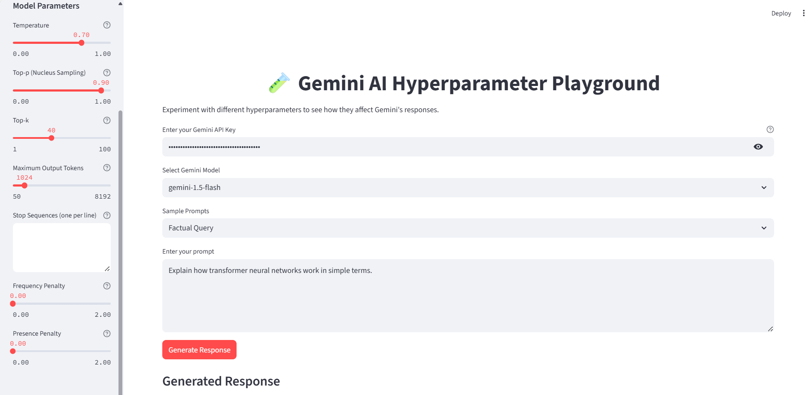
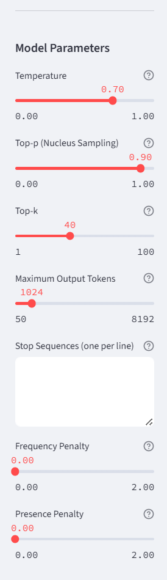
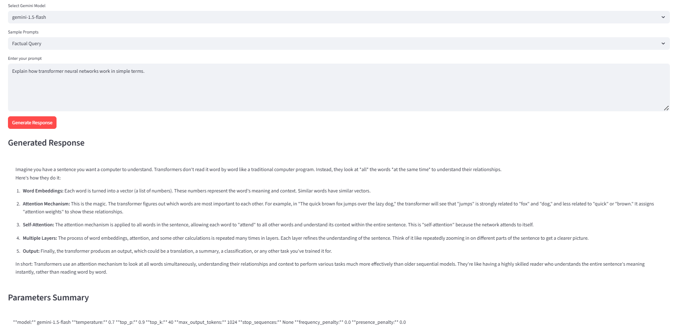
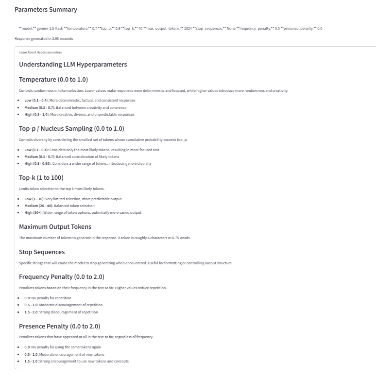

# Gemini AI Hyperparameter Playground

## What is the project about?

**Gemini AI Hyperparameter Playground** is an interactive web application that allows users to experiment with various hyperparameters of Google's Gemini large language models (LLMs). The app provides a user-friendly interface to adjust parameters like temperature, top-p, top-k, stop sequences, and more, and instantly see how these changes affect the model's responses. It is designed for educational and exploratory purposes, helping users understand the impact of different hyperparameters on LLM outputs.

## What is the stack?

- **Frontend & Backend:** [Streamlit](https://streamlit.io/) (Python)
- **LLM API:** [Google Generative AI (Gemini)](https://ai.google.dev/)
- **UI Components:** Custom CSS for light/dark themes, interactive sliders, and text inputs
- **Other:** Python standard libraries (`datetime`, `json`)

## How to get started

1. **Clone the repository:**
   ```sh
   git clone https://github.com/arnandew-microsoft/gemini-hyperparameter-playground.git
   cd gemini-hyperparameter-playground
   ```
2. **Install dependencies:**
   ```sh
   pip install -r requirements.txt
   ```
3. **Get a Gemini API key:**
   - Visit [Google AI Studio](https://aistudio.google.com/app/apikey) and generate your API key.
4. **Run the app:**
   ```sh
   streamlit run app.py
   ```
5. **Open the app in your browser:**
   - The app will open automatically, or visit [http://localhost:8501](http://localhost:8501)

## How to use this project

1. **Enter your Gemini API key** in the input box at the top.
2. **Select a Gemini model** (e.g., `gemini-1.0-pro`, `gemini-1.5-pro`, or `gemini-1.5-flash`).
3. **Adjust hyperparameters** in the sidebar:
   - Temperature
   - Top-p (Nucleus Sampling)
   - Top-k
   - Maximum Output Tokens
   - Stop Sequences
   - Frequency Penalty
   - Presence Penalty
4. **Choose a sample prompt** or enter your own prompt.
5. **Click "Generate Response"** to see the model's output and a summary of the parameters used.
6. **Switch between light and dark themes** using the sidebar toggle.
7. **Learn about each hyperparameter** in the expandable "Learn About Hyperparameters" section.

## Screenshots


Below are some example screenshots of the app in action:

### Main Interface


### Sidebar Hyperparameter Controls


### Response Generation Example


### Educational Section


---

This app is for educational purposes. Created to help understand how different hyperparameters affect LLM outputs.
